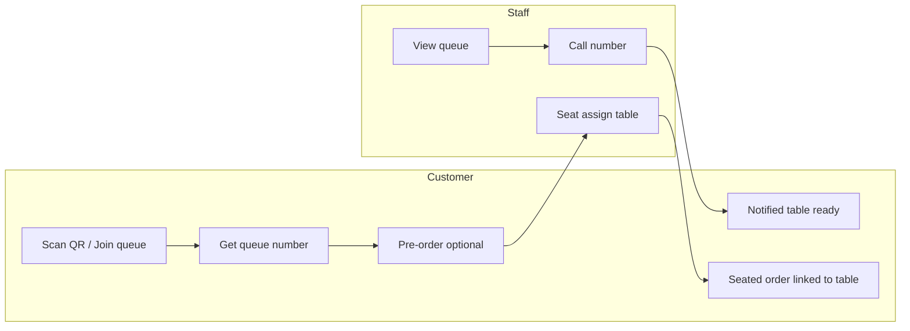

# Waitlist System Design (Restaurant Door Queue)

**Date:** 2025-02-06
**Status:** Design (ready for implementation)
**Related:** [FUNCTIONAL-REQUIREMENTS-RSVP.md](../doc/RSVP/FUNCTIONAL-REQUIREMENTS-RSVP.md) Section 3.5 (FR-RSVP-035 to FR-RSVP-038)

---

## 1. Primary use case: restaurant door queue

Simplest flow:

1. **Customer scans QR code on the door** → lands on store’s “Join waitlist” page (e.g. `/s/[storeId]/waitlist` or in-store entry point).
2. **Customer joins the queue** → enters name, phone, party size → submits → **receives a queue number and a random 6-digit verification code** (staff use the code to verify identity at the host stand) (e.g. “You are #7”).
3. **Store admin calls the number** → in staff UI, admin taps “Call #7” → **customer is notified** (SMS / LINE / in-app: “Your table is ready – #7” or “Please come to the host stand”).
4. **While waiting**, customer can **place an order** (pre-order). That order is linked to their waitlist entry.
5. **When customer is seated**, staff marks the waitlist entry as **seated** and assigns a **table (facility)**. The pre-order (if any) is then **associated with that table/facility** so the kitchen knows which table the order belongs to.

No reservation time slot: this is a **same-day walk-in queue** (FIFO by join time), not a slot-based “notify me when a time opens” flow. Slot-based waitlist can be added later as an extension.

---

## 2. Context and requirements

- **Current code:** No waitlist table in [schema.prisma](../prisma/schema.prisma). `StoreOrder` already has `facilityId` (table assignment); we use it when seating to link the pre-order to the table.
- **FR doc:** Section 3.5 defines waitlist creation, staff view, and notifications; this design implements the door-queue variant first.

---

## 3. Data model

Add **`WaitList`** (one row per party in the queue). All datetime fields **BigInt** (epoch ms). Status uses enum **`WaitListStatus`**.

```prisma
enum WaitListStatus {
  waiting
  called
  seated
  cancelled
  no_show
}

model WaitList {
  id             String   @id @default(uuid())
  storeId        String
  // Queue position: display number shown to customer (e.g. 1, 2, 3…). Can be derived per day/session or stored.
  queueNumber    Int      // e.g. 7 = "You are #7"
  // Random 6-digit code for staff to verify customer identity (e.g. when they come to host stand)
  verificationCode String @unique // e.g. "847291", unique so staff can look up by code
  numOfAdult     Int      @default(1)
  numOfChild     Int      @default(0)
  // Contact (for "call number" notification). Optional fields: last name, phone.
  customerId     String?
  lastName       String?  // optional
  phone          String?  // optional
  status         WaitListStatus @default(waiting)
  createdAt      BigInt
  updatedAt      BigInt
  notifiedAt     BigInt?  // when staff "called" this number (notification sent)
  seatedAt       BigInt?  // when status = seated
  // Table assigned when seated (StoreOrder.facilityId can be set from this)
  facilityId     String?
  // Pre-order placed while waiting; when seated, set Order.facilityId = this.facilityId
  orderId        String?  @unique
  createdBy      String?  // userId if staff added on behalf of customer

  Store    Store          @relation(fields: [storeId], references: [id], onDelete: Cascade)
  Customer User?          @relation(fields: [customerId], references: [id], onDelete: SetNull)
  Facility StoreFacility? @relation(fields: [facilityId], references: [id], onDelete: SetNull)
  Order    StoreOrder?    @relation(fields: [orderId], references: [id], onDelete: SetNull)

  @@index([storeId])
  @@index([storeId, status])
  @@index([storeId, createdAt])
  @@index([customerId])
  @@index([createdAt])
  @@index([verificationCode])
}
```

- **Store:** Add `WaitList WaitList[]`.
- **User:** Add `WaitList WaitList[]` (customer).
- **StoreFacility:** Add `WaitList WaitList[]`.
- **StoreOrder:** Add reverse relation `WaitList WaitList?` (no new column; Prisma infers from `WaitList.orderId`). When customer pre-orders while waiting, set `WaitList.orderId` to that order. When staff seats the party, set `WaitList.facilityId` and update `StoreOrder.facilityId` for that order so the order is associated with the table.

**Queue number:** Store `queueNumber` as a running sequence per store per day (e.g. next number when creating entry). Enables staff to "Call #7" with a single lookup (storeId + queueNumber + today's date scope).

**Verification code:** Random 6-digit string (e.g. "847291"), generated on create. Unique across waitlist entries so staff can key in the code to verify customer identity (e.g. at host stand: "What's your code?" → staff enters code → system shows matching queue entry). Use same approach as `Rsvp.checkInCode` (numeric, unique per store or globally).

---

## 4. Settings

- **RsvpSettings:** Add `waitlistEnabled Boolean @default(false)`. When `false`, customer-facing "Join waitlist" and staff waitlist view are hidden or read-only.
- Optional: `waitlistRequireSignIn Boolean @default(false)`. When `true`, customer must be signed in to join the queue (name/phone from account); when `false`, sign-in is optional and party size is the only default required field.

---

## 5. Customer flows

### 5.1 Join queue (QR at door)

- **Entry:** Customer scans QR code on door → lands on store waitlist page (e.g. `/s/[storeId]/waitlist` or in-store entry).
- **Form:** **Party size (numOfAdult, numOfChild) is the only default required field.** **Optional fields: last name, and phone.**  Phone is used for "call number" notification when provided.
- **Sign-in is required only when the store setting is enabled** (`waitlistRequireSignIn`); when required, customer must be signed in and name/phone are taken from their account.
- **Action:** `createWaitlistEntryAction(storeId, lastName?, phone?, numOfAdult, numOfChild, customerId?, message?)`.
- Validations: store exists, `waitlistEnabled`; if `waitlistRequireSignIn` then require signed-in customer (use account name/phone) before entering the wait list page;
- Compute next `queueNumber` for store (e.g. per-day sequence), generate random 6-digit `verificationCode` (unique), insert `WaitList` with `status: waiting`.
- **Confirmation:** Show queue number (e.g. "You are #7"), the **6-digit verification code** (e.g. "847291"), and short message ("We'll notify you when your table is ready. Show your code to staff when your number is called.").
- **Persist waitlist info to local storage** (good for the day) so it can be retrieved when placing an order or returning to the page (see 5.2).
- If signed-in, send notification in LINE/email (e.g. "Your code: 847291").

### 5.2 Pre-order while waiting

- **Flow:** From the same waitlist confirmation page (or link from notification), customer can "Place order" (store's existing order flow). When creating the order, pass `waitlistId` (or store it when order is created so the waitlist entry can be updated with `orderId`).
- **Save waitlist info to local storage (good for the day):** After the customer joins the queue, persist waitlist info in the browser's local storage (e.g. `waitlistId`, `storeId`, queue number, verification code, and optionally expiry at end of day). This allows the app to retrieve the current waitlist entry when the customer navigates to "Place order", refreshes the page, or returns later the same day, so the order can be linked to the correct waitlist entry and the customer can see their queue status.
- **Link:** Set `WaitList.orderId = order.id` when order is created in "waitlist context" (e.g. by reading `waitlistId` from local storage or from the current page). When staff later marks this entry as seated and assigns a table, update `StoreOrder.facilityId` to that table so the order is associated with the facility.

---

## 6. Store admin / staff flows

### 6.1 View queue

- **Location:** e.g. `/[storeId]/rsvp/waitlist` or "Waitlist" tab. List entries with `status IN ('waiting','called')` for the store, ordered by `queueNumber` or `createdAt`.
- **Columns:** Queue #, **6-digit code**, party size, name, phone, status (waiting / called), has pre-order (orderId present), created at. Actions: "Call number", "Seat", "Cancel".
- **Verify by code:** Staff can enter: the 6-digit code, or phone number to look up the waitlist entry and confirm customer identity (e.g. when customer says "I'm #7" at the host stand, staff can ask for the code and key it in to verify).

### 6.2 Call number

- **Action:** `callWaitlistNumberAction(storeId, waitlistId)`. Set `status = 'called'`, set `notifiedAt = now`. Send notification to customer (SMS / LINE / email): "Your table is ready – #N" or "Please come to the host stand – #N".
- **Permission:** Store staff and store admins.

### 6.3 Seat (assign table)

- **Action:** `seatWaitlistEntryAction(storeId, waitlistId, facilityId)`. Set `status = 'seated'`, `facilityId = selected table`, `seatedAt = now`. If `WaitList.orderId` is set, update `StoreOrder.facilityId` for that order to the same `facilityId` so the pre-order is associated with the table.
- **Permission:** Store staff and store admins.

### 6.4 Cancel

- Staff can set `status = 'cancelled'` for an entry (e.g. no-show after call).

---

## 7. Notifications

- **When staff calls number:** Send customer (SMS / LINE / email per store config): "Your table is ready – #N" or "Please come to the host stand – #N". Use existing notification pipeline (e.g. rsvp-notification-router or a small waitlist sender).
- **Optional:** In-app or push notification if customer has the store page open.

---

## 8. Implementation order (high level)

1. **Schema and migration:** Add `WaitList` (with `queueNumber`, `status`, `orderId`, `facilityId`, `notifiedAt`, `seatedAt`); add `waitlistEnabled` (and optional `waitlistRequireSignIn`) to `RsvpSettings`; add relations on Store, User, StoreFacility, StoreOrder.
2. **Server actions:** `createWaitlistEntryAction` (customer, assign queue number); `listWaitlistAction`, `callWaitlistNumberAction`, `seatWaitlistEntryAction`, `cancelWaitlistEntryAction` (staff).
3. **Customer UI:** Waitlist join page (e.g. `/s/[storeId]/waitlist`) – form (name, phone, party size), submit → show queue number; optional "Place order" that links order to waitlist entry.
4. **Store admin UI:** Waitlist page/tab – list by queue #, actions "Call number", "Seat" (with facility picker), "Cancel". When seating, if entry has `orderId`, set that order's `facilityId` to the selected table.
5. **Notifications:** "Table ready – #N" when staff calls number.
6. **i18n:** Keys for waitlist join, queue number, call number, seat, staff table headers, notification text (en/tw/jp).

---

## 9. Edge cases and rules

- **Queue number:** Per-store, per-day sequence (e.g. new day resets or use date in scope). Uniqueness: one active number per store per day for "waiting" / "called" (or allow gaps if entries are cancelled).
- **Pre-order:** One order per waitlist entry (1:1). When creating order from waitlist context, set `WaitList.orderId` after order is created (or pass waitlistId when creating order and set orderId on waitlist in the same flow).
- **No-show:** Staff can mark as `cancelled` or `no_show` after "called" if customer doesn't show.

---

## 10. Diagram (lifecycle)



---

## 11. Files to add or change (summary)

| Area | Files |
|------|--------|
| Schema | `prisma/schema.prisma` – add `WaitList`, `waitlistEnabled` (and optional `waitlistRequireSignIn`) on `RsvpSettings`, relations; StoreOrder reverse relation for waitlist |
| Actions | New: `create-waitlist-entry.ts` (customer), `list-waitlist.ts`, `call-waitlist-number.ts`, `seat-waitlist-entry.ts`, `cancel-waitlist-entry.ts` (storeAdmin); validation schemas |
| Customer UI | New: `/s/[storeId]/waitlist` page – join form, queue number display; optional "Place order" linking to waitlist |
| Store admin UI | New: waitlist page under `[storeId]/rsvp/waitlist` – queue list, Call / Seat / Cancel actions; seat flow sets facilityId on waitlist and on linked order |
| Notifications | Waitlist "table ready" notification when staff calls number |
| i18n | `locales/en|tw|jp/translation.json` – waitlist copy |
| Docs | Update FUNCTIONAL-REQUIREMENTS-RSVP.md Section 3.5 to reference door-queue waitlist and `WaitList` |

**Extension later:** Slot-based waitlist ("notify me when this time opens") and range-based "Notify Me" can reuse or extend this model (e.g. add `rsvpTime`, `status = pending | notified | fulfilled`).
