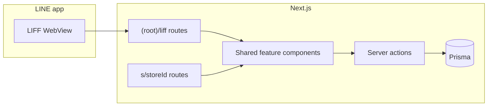

# LIFF phased roadmap (waitlist → RSVP → ordering)

**Date:** 2026-04-29
**Status:** Active — Phase 2 (RSVP) complete; Phase 3 (ordering) next
**Related:** [LINE notification / LINE Login](./LINE-NOTIFICATION-INTEGRATION.md), [RSVP-centric LIFF design](./LIFF-RSVP.md), [Environment variables](../../ENVIRONMENT_VARIABLES.md), [INTEGRATIONS README](../README.md), [LINE Developers - Developing a LIFF app](https://developers.line.biz/en/docs/liff/developing-liff-apps/)

## LIFF app at a glance

**LINE LIFF** (LINE Front-end Framework) is a **web app that runs inside the LINE client** (in-app browser). For riben.lifeife, the LIFF app is the **LINE-native front door** to the same product customers already use on the web: join a **waitlist**, manage **reservations (RSVP)**, and complete **orders / checkout**—without leaving LINE.

- **Who uses it:** End customers who discover the store via the **Official Account**, **Rich Menu**, **flex messages**, or **chat** deep links.
- **What it is not:** A separate product or duplicate business layer. It does **not** replace the **Messaging API** (push templates, “you’re called,” order updates); LIFF is for **interactive** flows, messaging is for **proactive** notifications (see [LINE-NOTIFICATION-INTEGRATION.md](./LINE-NOTIFICATION-INTEGRATION.md)).
- **Identity:** LINE provides a stable **LINE user id** and profile; the app links that to riben.lifeife accounts where **sign-in** or **orders** require it (`User.line_userId`, Better Auth / LINE Login—same model as the web).
- **Technical shape:** All LIFF **routes** are under **`src/app/(root)/liff`** with URLs like `/liff/...`. Pages are **thin shells**: they load the **same** server actions and (where possible) the **same** React modules as `s/[storeId]/...`, plus a small LIFF bootstrap (`liff.init`, in-client detection, LINE-friendly layout).

## Overview

This document is the **phased roadmap** to build that LIFF surface. Work is ordered by complexity: **waitlist** → **RSVP** → **ordering/checkout** (LINE Pay). Phase **0** is shared foundation (SDK, routing, auth bridge, logging).

For placement rules and the “one implementation, two shells” rule, see **Platform placement** below.

## Current baseline (repo)

### Phase 0 — Foundation (complete)

- `@line/liff` with [`LiffProvider`](../../../src/providers/liff-provider.tsx) in [`(root)/liff/layout.tsx`](../../../src/app/(root)/liff/layout.tsx).
- [`liff/[storeId]/layout.tsx`](../../../src/app/(root)/liff/[storeId]/layout.tsx) wraps every store sub-page with [`LiffStoreCustomerShell`](../../../src/app/(root)/liff/components/liff-store-customer-shell.tsx) (bottom navigation bar, account / waitlist / reservation links) and [`CustomerStoreBasePathProvider`](../../../src/providers/customer-store-base-path.tsx) so client components resolve `/liff/...` paths automatically.
- [`liff/[storeId]/page.tsx`](../../../src/app/(root)/liff/[storeId]/page.tsx) — store home rendered by [`LiffStoreHome`](../../../src/app/(root)/liff/components/liff-store-home.tsx); mode-aware reservation quick-links (facilities / staff / open-booking depending on `RsvpSettings.rsvpMode`).
- [`liff/page.tsx`](../../../src/app/(root)/liff/page.tsx) — smoke / entry redirect.
- **Post-login deep link:** [`liff-return-path.ts`](../../../src/lib/liff-return-path.ts) wired from `LiffProvider` and sign-in redirects.
- **LINE identity**: `User.line_userId` populated via LINE Login (Better Auth).
- **Messaging API**: notifications to linked users; separate from LIFF.

### Phase 1 — Waitlist (complete)

- **`/liff/[storeId]/waitlist`** — [`liff/[storeId]/waitlist/page.tsx`](../../../src/app/(root)/liff/[storeId]/waitlist/page.tsx) uses shared [`getWaitlistPublicPageData`](../../../src/lib/store/waitlist/get-waitlist-public-page-data.ts) and [`WaitlistPublicClient`](../../../src/components/store/waitlist/waitlist-public-client.tsx); same server actions as `s/[storeId]/waitlist`.
- Optional thin redirect under `liff/waitlist` for older taps — do not emit new query-style URLs.

### Phase 2 — RSVP (complete)

All three `RsvpMode` values are now fully served under `/liff/[storeId]/reservation/...`, reusing the same client components and server actions as `s/[storeId]/reservation/...`.

| Route | Mode | Component |
|-------|------|-----------|
| `/liff/[storeId]/reservation` | hub — routes by mode | picks facility / staff / redirects to `/open` |
| `/liff/[storeId]/reservation/[facilityId]` | `FACILITY` (0) | [`FacilityModeReservationClient`](../../../src/app/s/[storeId]/reservation/[facilityId]/components/facility-mode-reservation-client.tsx) |
| `/liff/[storeId]/reservation/open` | `RESTAURANT` (2) | [`RestaurantModeReservationClient`](../../../src/app/s/[storeId]/reservation/[facilityId]/components/restaurant-mode-reservation-client.tsx) |
| `/liff/[storeId]/reservation/service-staff/[serviceStaffId]` | `PERSONNEL` (1) | [`PersonnelServiceStaffReservationClient`](../../../src/app/s/[storeId]/reservation/[facilityId]/components/personnel-service-staff-reservation-client.tsx) |

Data fetching uses [`getCachedLiffStoreHomeData`](../../../src/app/(root)/liff/[storeId]/get-cached-liff-store-home-data.ts) (React cache over `getStoreHomeDataAction`) + `getSessionSafely()` throughout; no shared booking client components were modified.

**Remaining gaps:**

- AI chat (Phase 2b) — still deferred.
- Staff-only features (Google Calendar sync, etc.) intentionally excluded from LIFF.

### Other baseline

- **Ordering**: [`s/[storeId]/checkout`](../../../src/app/s/[storeId]/checkout/page.tsx); LINE Pay credentials on `Store` (`LINE_PAY_ID` / `LINE_PAY_SECRET` in Prisma). LIFF wrappers not yet built (Phase 3).

**Existing design doc:** [LIFF-RSVP.md](./LIFF-RSVP.md) is RSVP/AI-centric. This roadmap re-phases by product; treat **AI chat** as optional (Phase 2b) so it does not block other work.

## Platform placement (non-negotiable)

### 1. All LIFF routes under `(root)/liff`

- Implement LIFF only under [`src/app/(root)/liff/`](../../../src/app/(root)/liff/) (create this tree in Phase 0).
- **LINE Developers Console**: set each LIFF app **Endpoint URL** to the production/staging host with a **`/liff/...`** path (for example `https://your-domain.com/liff/{storeId}/waitlist`, or a single entry `https://your-domain.com/liff` plus `liff.state` / query params — pick one strategy and keep it consistent here and in OA links).
- Do **not** use `s/[storeId]` as the LIFF-only entry URL; Rich Menu / flex / OA links should target **`/liff/...`**.

### 2. LIFF = LINE shell; ~99% shared with normal web

- **Same server actions, same validation**, same Prisma access: everything under [`src/actions/store/`](../../../src/actions/store/) (and shared libs) is the single source of truth. LIFF pages must not fork business rules.
- **Same client logic**: extract or import existing client components from `s/[storeId]/...` (waitlist, reservation, checkout). Preferred pattern:
  - **Thin route:** `(root)/liff/[storeId]/waitlist/page.tsx` composes a **shared** feature component plus `LiffProvider` / layout chrome.
  - If code is tied to `s/` paths, **lift shared UI** into a neutral location (for example `src/components/store/` or `src/features/<domain>/`) so **both** `s/[storeId]/...` and `liff/[storeId]/...` import it.
- **LIFF-specific code stays minimal:** `@line/liff` init, `liff.isInClient()`, optional profile prefill, LINE-friendly layout, and **payment return URLs** under `/liff/...` when required.
- **UI may differ** (layout, copy) but **behavior and data paths** match the web app.

## Phase 0 — Foundation (all LIFF features)

**LINE Developers**

- Create **LIFF app(s)** per environment; **Endpoint URL** must match **`(root)/liff`** paths on the deployed origin (not `s/[storeId]`).
- Configure **scopes** (profile, openid as needed) and align **LIFF with the same Official Account** as Messaging when friend/add flows matter.

**Application**

- Add LIFF SDK (`@line/liff`); add **`(root)/liff/layout.tsx`** wrapping **`LiffProvider`** so LIFF initializes once on the client (`liff.init`, `liff.isInClient()`, `getProfile` / ID token as needed).
- **Routing contract** under `/liff`: mirror feature areas with stable segments, e.g. `/liff/[storeId]/waitlist`, `/liff/[storeId]/reservation/...`, `/liff/[storeId]/checkout`.
- **Auth bridge:** link LIFF users to Better Auth / `User.line_userId` where sign-in is required; avoid duplicate auth state.
- **Security:** CSRF-safe server actions / API routes; never trust `storeId` from the client alone — revalidate store exists and feature flags (`WaitListSettings.enabled`, `acceptReservation`, order-system flags).

**Observability**

- Structured logging for LIFF init failures, token issues, and feature gates (reuse [`logger`](../../../src/lib/logger.ts)).

## Phase 1 — Waitlist

**Why first:** Narrow scope, strong LINE fit (Messaging for “you’re called”), lower risk than payments.

**MVP**

- Route: **`/liff/[storeId]/waitlist`** (under `(root)/liff`) — page wires **shared** waitlist UI + LIFF layout.
- Pre-fill display name from LINE profile where `WaitListSettings.requireName` allows; if `requireSignIn` / `requireLineOnly`, enforce Better Auth session (and LINE OAuth account when LINE-only) before `createWaitlistEntryAction`.
- Reuse actions: [`create-waitlist-entry`](../../../src/actions/store/waitlist/create-waitlist-entry.ts), [`get-waitlist-queue-position`](../../../src/actions/store/waitlist/get-waitlist-queue-position.ts), [`cancel-my-waitlist-entry`](../../../src/actions/store/waitlist/cancel-my-waitlist-entry.ts) — no duplicated waitlist business logic.
- **Refactor if needed:** move logic from [`waitlist-join-client.tsx`](../../../src/app/s/[storeId]/waitlist/components/waitlist-join-client.tsx) into a shared module imported by both `s/.../waitlist` and `liff/.../waitlist`.

**Follow-ups**

- Push “called” / queue updates via the existing LINE notification pipeline when `User.line_userId` is known.
- Optional: in-store QR → same LIFF URL (align with QR patterns in waitlist client).

## Phase 2 — RSVP (complete)

All three `RsvpMode` values are implemented. See the route table in **Current baseline → Phase 2** above.

**Design decisions**

- LIFF server pages use `getCachedLiffStoreHomeData` (React `cache` over `getStoreHomeDataAction`) instead of direct Prisma queries — avoids duplicating store/settings fetches already done by the layout.
- `getSessionSafely()` wraps `auth.api.getSession` to tolerate LIFF's auth state on first load.
- No booking client components were modified; LIFF pages are thin shells.
- `LiffStoreHome` quick-links respect `rsvpMode`: facility cards (FACILITY), staff cards (PERSONNEL), or a single store card (RESTAURANT).

**Still deferred**

- OA deep links → reservation detail / history (requires signed or opaque tokens).
- **AI chat** from [DESIGN-LINE-LIFF_APP-RSVP.md](./DESIGN-LINE-LIFF_APP-RSVP.md) — Phase 2b or parallel track.

## Phase 3 — Ordering (cart / checkout / LINE Pay)

**Why last:** Cart, taxes, payments, LINE Pay, fulfillment notifications.

**MVP**

- Routes under **`/liff/[storeId]/checkout`** (and cart entry as needed) that import the **same** checkout/cart modules as [`checkout/page.tsx`](../../../src/app/s/[storeId]/checkout/page.tsx); wrap with LIFF layout; set **return/cancel URLs** to `/liff/...` where providers require absolute URLs.
- **LINE Pay:** verify flow inside LIFF WebView; whitelist **`/liff/...`** URLs in LINE Pay / gateway configuration.
- Post-order: reuse existing notification templates.

**Hardening**

- Fraud / double-submit, inventory locks, session expiry in WebView.

## Documentation and environment

- **This file** is the URL / phasing source of truth; extend with a concrete **URL matrix** and **shared-component map** as implementation progresses.
- **[ENVIRONMENT_VARIABLES.md](../../ENVIRONMENT_VARIABLES.md):** document `NEXT_PUBLIC_LIFF_ID` (and any per-store or multi-LIFF-endpoint strategy).

## Implementation checklist (tracking)

| Phase | Deliverable | Status |
| ----- | ----------- | ------ |
| 0 | `(root)/liff` layout, LIFF SDK init, `NEXT_PUBLIC_LIFF_ID`, shared providers, auth bridge, `LiffStoreCustomerShell` bottom bar | done |
| 1 | `liff/.../waitlist` routes wrapping shared waitlist UI + actions; optional Messaging for called/queue | done |
| 2 | All 3 `RsvpMode` routes (`[facilityId]`, `open`, `service-staff/[id]`); mode-aware home + hub; no client component changes | done |
| 2b | OA deep links to reservation detail/history (signed tokens); AI chat | pending |
| 3 | `liff/.../checkout` wrappers; LINE Pay return URLs; shared checkout logic with `s/[storeId]` | pending |

## Suggested sequencing summary

| Phase | System | Primary deliverable | Status |
| ----- | ------ | ------------------- | ------ |
| 0 | Cross-cutting | LIFF init, routing, auth/link strategy, logging | done |
| 1 | Waitlist | LIFF waitlist join/status/cancel + optional LINE push | done |
| 2 | RSVP | All 3 booking modes; mode-aware home/hub | done |
| 2b | RSVP | OA deep links, AI chat | pending |
| 3 | Ordering | LIFF checkout + LINE Pay validation + order notifications | pending |

This order reduces dependency risk (waitlist → RSVP → money) while reusing existing server actions and the LINE notification model.

## Summary

1. All LIFF UI routes live under **`src/app/(root)/liff`**, with LINE Endpoint URLs pointing at **`/liff/...`**.
2. Reuse **store server actions** and **shared client modules**; LIFF adds only LINE bootstrap and presentation.
3. Phases 0, 1, and 2 are shipped. Next: Phase 2b (OA deep links, AI chat) and Phase 3 (ordering / LINE Pay).
4. **AI chat** remains optional and does not block ordering work.
