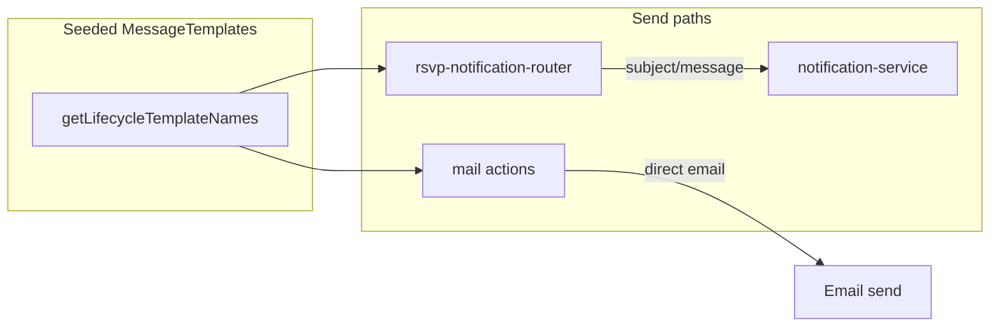

# Lifecycle messages: hook coverage and usage

## Current behavior (verified)

- **Canonical keys**: `buildLifecycleTemplateKey` in [web/src/lib/notification/template-registry.ts](web/src/lib/notification/template-registry.ts) produces names like `reservation.ready.customer.email`.
- **Reservation router**: [web/src/lib/notification/rsvp-notification-router.ts](web/src/lib/notification/rsvp-notification-router.ts) resolves templates only via `renderLifecycleTemplateMessage`, which **always** uses `channel: "email"` when looking up `MessageTemplate` (lines 388–393), then broadcasts the same `subject`/`message` to onsite/LINE/SMS/etc. through `NotificationService.createNotification`.
- **Duplicated / divergent paths**: `routeNotification` dispatches `eventType: "ready"` to `handleReady` (uses lifecycle for customer), while `eventType: "status_changed"` with `RsvpStatus.Ready` notifies the customer with **plain i18n** only (lines ~1182–1227), bypassing `renderLifecycleTemplateMessage`. Same pattern for **customer** `CheckedIn` (staff path uses lifecycle ~1248; customer path ~1268–1303 does not).
- **Gaps without lifecycle render** (i18n-only today):
  - `handleUnpaidOrderCreated`: logged-in customer branch (~2003–2028) sends `subject`/`message` from builders, not `reservation.unpaid_order_created.customer.email`. Anonymous SMS concatenates i18n strings, not `*.sms` lifecycle rows.
  - `handleReminder` and `handleCustomerConfirmRequired`: customer notifications use i18n builders only (~2411+ and ~2671+).
- **Intentionally unused rows**: `handleCreated` only notifies **staff** with lifecycle; **customer** lifecycle for `reservation.created` is commented out with “customer should not receive this notification” (~757–791), so seeded `reservation.created.customer.*` keys are never consumed if that policy stays.
- **Order domain**: [web/src/actions/mail/send-credit-success.ts](web/src/actions/mail/send-credit-success.ts) and [web/src/actions/mail/send-cancel-subscrption.ts](web/src/actions/mail/send-cancel-subscrption.ts) implement `order.credit_topup_completed.customer.email` and `order.cancelled.customer.email` respectively, but **neither symbol is imported anywhere else in the repo** (dead entry points). Broader order events (`created`, `paid`, `payment_received`, `completed`, `refunded`) have no corresponding `buildLifecycleTemplateKey` usage outside this dead code path.
- **Semantics note**: `sendCancelSubscription` maps **platform subscription cancel** to `order.cancelled`—likely wrong domain; any new wiring should align key with the real event (or split a dedicated lifecycle event if needed).

## Recommended approach

### 1) Produce a definitive coverage map (before / after)

- Add a small script or **Vitest** test that:
  - Imports `getLifecycleTemplateNames()` from [template-registry.ts](web/src/lib/notification/template-registry.ts).
  - For each name, records **status**: `resolved_at_send` (code path actually calls `findFirst`/`TemplateEngine` with that name or passes through `buildLifecycleTemplateKey` with matching args), `intentionally_unused` (documented product decision), or `gap`.
  - Optionally cross-check [web/doc/NOTIFICATION/LIFECYCLE-NOTIFICATION-MATRIX.md](web/doc/NOTIFICATION/LIFECYCLE-NOTIFICATION-MATRIX.md) vs [ORDER_LIFECYCLE_EVENTS](web/src/lib/notification/lifecycle-events.ts) / reservation events and fix doc drift in the same pass.

This makes “every lifecycle row hooked” objectively verifiable in CI.

### 2) Reservation: unify lifecycle usage

- **Deduplicate Ready path**: When `handleStatusChanged` hits `RsvpStatus.Ready` for a logged-in customer, **delegate to** `handleReady` (or extract a shared `notifyCustomerReady()` that always calls `renderLifecycleTemplateMessage` for `event: "ready", recipient: "customer"`). Eliminates double logic and ensures `reservation.ready.customer.email` is always used when that path runs.
- **Checked-in customer**: After building i18n fallbacks, wrap with `renderLifecycleTemplateMessage({ event: "checked_in", recipient: "customer", ... })` mirroring staff.
- **`handleUnpaidOrderCreated`**: For `hasCustomerId`, replace raw `subject`/`message` with rendered lifecycle for `unpaid_order_created` / `customer`. For anonymous SMS, choose one of:
  - **Minimal**: keep i18n-built SMS body but mark `reservation.*.*.sms` as “synced copy of email/fallback” in docs; or
  - **Full matrix**: call `TemplateEngine` with `channel: "sms"` and `buildLifecycleTemplateKey({ ..., channel: "sms" })` for the SMS body (and ensure payload/tags work for SMS length).
- **`handleReminder`** and **`handleCustomerConfirmRequired`**: Prepend lifecycle render for `reminder` / `customer_confirm_required` with same fallback pattern as existing methods.
- **`reservation.created.customer`**: Decide with product: **enable** (uncomment/adapt block to use `renderLifecycleTemplateMessage`) or **remove / stop seeding** customer rows and mark catalog entries as N/A in the matrix so the DB does not imply they are user-facing.

### 3) Order: wire real business events

- Trace where **credit top-up orders** and **subscription cancellation** complete (Stripe webhook, store actions, etc.) and **import and call** `sendCreditSuccess` / `sendCancelSubscription` (or fold them into a single `sendOrderLifecycleEmail` helper that takes `OrderLifecycleEvent`).
- For **store purchase orders** (`paid`, `payment_received`, `completed`, `refunded`, `cancelled`, `created` as applicable): locate the existing notification or mail hooks in checkout/payment code and add lifecycle resolution using the same pattern as reservation (template lookup + `TemplateEngine.render` + fallback).
- Revisit **`order.cancelled` for subscription**: if the event is not a store order lifecycle, introduce a clearer template name (e.g. `platform.subscription_cancelled.customer.email`) **or** document that `order.cancelled` doubles for both—avoid silent misuse.

### 4) Channel semantics (scope control)

- **Short term (matches current architecture)**: Document in [LIFECYCLE-NOTIFICATION-MATRIX.md](web/doc/NOTIFICATION/LIFECYCLE-NOTIFICATION-MATRIX.md) that **lifecycle body copy is authoritative for the `.email` row**; other channel rows may mirror email for admin editing or future use, while onsite/LINE/email today share one rendered body unless you extend the router.
- **Long term (only if you require distinct SMS/LINE copy)**: Extend `renderLifecycleTemplateMessage` (or add `renderLifecycleForChannel`) to pass the **actual outbound channel** into `buildLifecycleTemplateKey` and `TemplateEngine.render` `{ channel }` options, and call it per channel when enqueueing—larger change touching [queue-manager](web/src/lib/notification/queue-manager.ts) / processors.

### 5) Tests

- Router tests: scenarios for `status_changed` → Ready/CheckedIn customer now assert rendered subject/body come from **fixture MessageTemplate** when present.
- Integration or unit tests for new order call sites: after hooking `sendCreditSuccess` / payment completion, assert lifecycle template name used.
- Keep the **catalog coverage** test from step 1 updated as the source of truth.

## Out of scope unless you ask

- Rewriting all LINE Flex builders to read from `*.line` lifecycle rows (currently Flex is structured separately from DB templates).

## Follow-up: catalog and reservation seed (2026-05)

- **Authoritative copy**: Reservation lifecycle email subjects and bodies live in [message-template-backup-reservation.json](../../public/backup/message-template-backup-reservation.json); [LIFECYCLE-NOTIFICATION-MATRIX.md](./LIFECYCLE-NOTIFICATION-MATRIX.md) summarizes coverage and email subjects.
- **Removed from catalog and backup**: `reservation.completed.staff.*`, `reservation.no_show.staff.*`, `reservation.customer_confirm_required.*` ([template-registry.ts](../../src/lib/notification/template-registry.ts)).
- **Runtime without catalog keys**: `handleNoShow` (staff) and `handleCustomerConfirmRequired` (customer) still call `renderLifecycleTemplateMessage` but fall back to i18n builders when no `MessageTemplate` row exists.
- **Seeded gap**: `reservation.no_show.customer.*` remains in the backup; no customer send path in `handleNoShow` today.
- **CI gap count**: [lifecycle-coverage-audit.test.ts](../../src/lib/notification/__tests__/lifecycle-coverage-audit.test.ts) expects **13** email-catalog gaps (see `EXPECTED_GAP_COUNT` and comment in that file).
