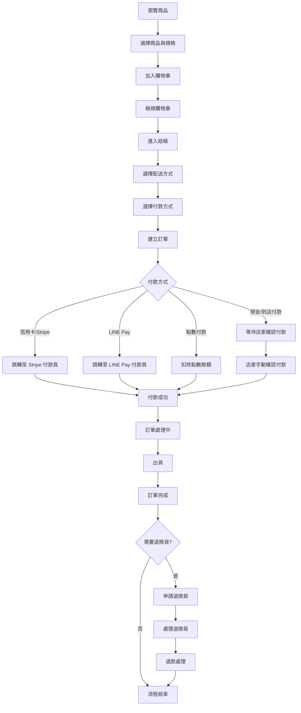
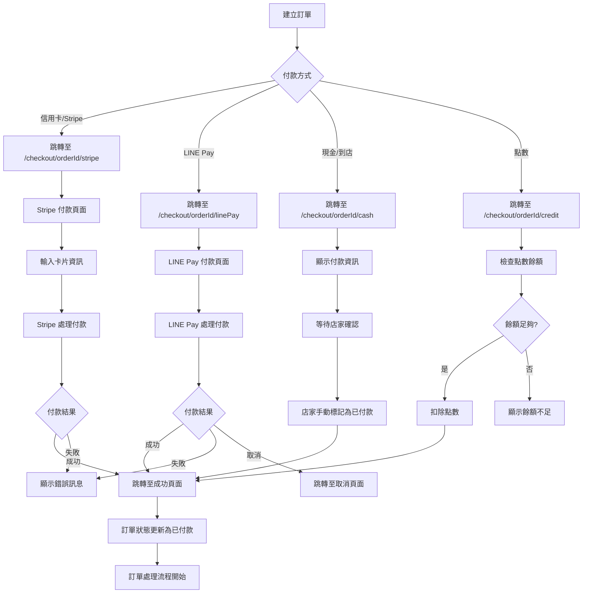
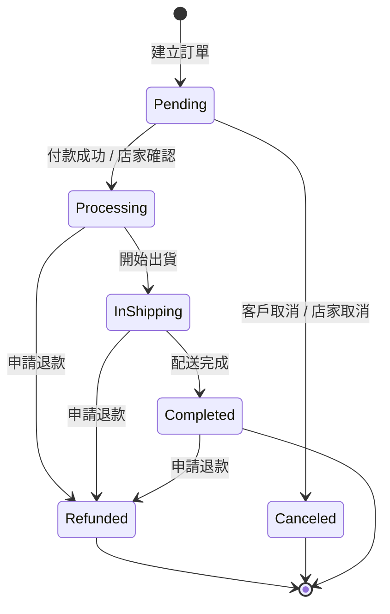
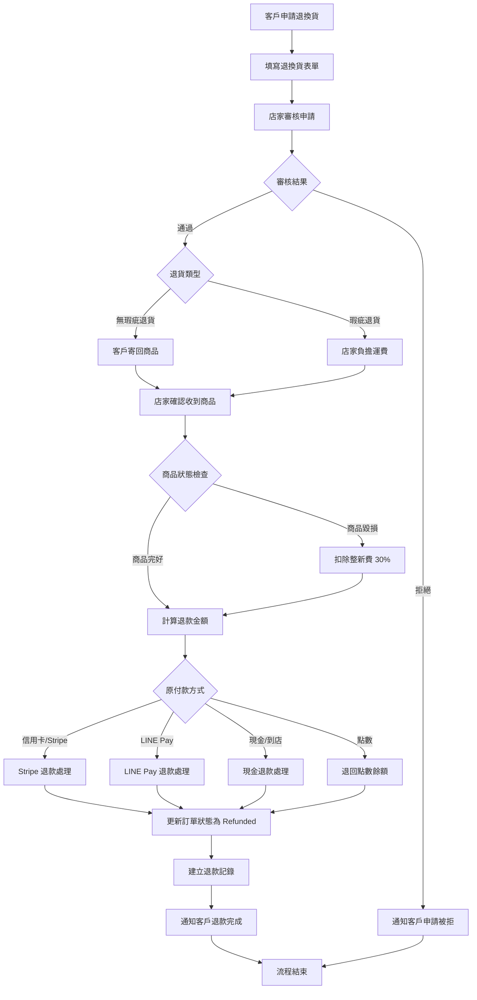

# 線上交易流程圖

**建立日期：** 2025-01-XX  
**狀態：** Active  
**適用範圍：** 所有商店的線上交易流程

## 目錄

1. [流程總覽](#流程總覽)
2. [商品瀏覽與價格顯示](#商品瀏覽與價格顯示)
3. [購物車流程](#購物車流程)
4. [結帳流程](#結帳流程)
5. [付款處理](#付款處理)
6. [訂單狀態流程](#訂單狀態流程)
7. [退換貨政策](#退換貨政策)
8. [退款流程](#退款流程)

---

## 流程總覽



---

## 商品瀏覽與價格顯示

### 1. 商品列表頁面

**顯示內容：**

- 商品名稱
- 商品圖片
- 商品價格（基礎價格）
- 商品分類
- 是否為精選商品
- 庫存狀態（如啟用庫存追蹤）

**價格計算邏輯：**

```
商品基礎價格 = 商品設定的價格
```

### 2. 商品詳情頁面

**顯示內容：**

- 商品完整資訊
- 商品描述
- 多張商品圖片
- **價格明細：**
  - 基礎價格：NT$ XXX
  - 規格選項（Variants）：
    - 尺寸：S / M / L / XL（價格差異）
    - 顏色：紅 / 藍 / 綠（價格差異）
  - 加購選項（Options）：
    - 加購項目 A：+NT$ XX
    - 加購項目 B：+NT$ XX
  - **小計：** NT$ XXX（基礎價格 + 規格加價 + 加購項目）

**價格計算公式：**

```
單價 = 基礎價格 + 規格加價總和 + 加購選項加價總和
小計 = 單價 × 數量
```

**範例：**

```
商品：T恤
基礎價格：NT$ 500
選擇規格：
  - 尺寸：L（+NT$ 0）
  - 顏色：紅色（+NT$ 50）
選擇加購：
  - 加購刺繡（+NT$ 100）
數量：2

計算：
單價 = 500 + 0 + 50 + 100 = NT$ 650
小計 = 650 × 2 = NT$ 1,300
```

---

## 購物車流程

### 1. 購物車顯示

**購物車內容：**

- 商品名稱
- 商品規格（Variants）
- 商品選項（Options）
- 單價
- 數量（可調整）
- 小計（單價 × 數量）
- 移除按鈕

**購物車摘要：**

```
商品小計：NT$ X,XXX
運費：NT$ XXX（依選擇的配送方式）
稅金：NT$ XX（如適用）
折扣：-NT$ XX（如適用）
─────────────────
總計：NT$ X,XXX
```

### 2. 購物車操作

**可用操作：**

- ✅ 調整商品數量（+ / -）
- ✅ 移除單一商品
- ✅ 清空購物車
- ✅ 繼續購物
- ✅ 前往結帳

**購物車驗證：**

- 商品必須為啟用狀態
- 商品必須有庫存（如啟用庫存追蹤）
- 數量必須為正整數
- 規格和選項必須有效

**購物車持久化：**

- 購物車資料儲存在 `localStorage`
- 每個商店有獨立的購物車
- 跨瀏覽器會話保持購物車內容

---

## 結帳流程

### 步驟 1：檢視購物車

**畫面內容：**

- 購物車商品列表
- 商品小計
- 可選：訂單備註欄位

**操作：**

- 確認商品和數量
- 可返回修改購物車
- 可新增訂單備註

### 步驟 2：選擇配送方式

**顯示內容：**

- 可用的配送方式列表
- 每個配送方式的：
  - 名稱
  - 基本運費
  - 配送時間說明
  - 配送範圍說明

**選擇後：**

- 運費自動加入總計
- 總計金額即時更新

**範例：**

```
配送方式選項：
□ 宅配到府：NT$ 100（3-5 個工作天）
☑ 超商取貨：NT$ 60（2-3 個工作天）
□ 到店自取：NT$ 0（需預約）
```

### 步驟 3：選擇付款方式

**顯示內容：**

- 可用的付款方式列表
- 每個付款方式的：
  - 名稱
  - 圖示
  - 手續費說明（如適用）
  - 適用範圍說明

**付款方式類型：**

1. **信用卡付款（Stripe）**
   - 支援 Visa, Mastercard, JCB 等
   - 跳轉至 Stripe 安全付款頁面
   - 手續費：依店家設定

2. **LINE Pay**
   - 使用 LINE Pay 帳戶付款
   - 跳轉至 LINE Pay 付款頁面
   - 手續費：依店家設定

3. **現金/到店付款**
   - 適合到店自取或現場交易
   - 無手續費
   - 需等待店家確認收款

4. **點數付款**
   - 使用帳戶點數餘額
   - 即時扣除點數
   - 無手續費

**選擇後：**

- 付款手續費（如適用）自動加入總計
- 總計金額即時更新

### 步驟 4：建立訂單

**訂單建立前驗證：**

- ✅ 購物車不為空
- ✅ 所有商品仍為可用狀態
- ✅ 數量為有效值
- ✅ 總計計算正確
- ✅ 已選擇配送方式
- ✅ 已選擇付款方式

**訂單建立：**

- 系統產生唯一訂單 ID（UUID）
- 系統產生 6 位數取貨碼
- 系統設定訂單狀態：
  - `Pending`（待確認）：如店家未啟用自動接受訂單
  - `Processing`（處理中）：如店家啟用自動接受訂單
- 系統設定付款狀態：`Pending`（待付款）
- 系統記錄：
  - 訂單總額
  - 幣別（來自店家設定）
  - 折扣金額（如適用）
  - 稅金（如適用）
  - 運費
  - 付款手續費
- 系統建立訂單項目（OrderItems）
- 系統建立訂單備註（如提供）
- 系統連結客戶（如已登入）
- 系統連結設施（如適用，例如預約）

**訂單建立後：**

- 購物車自動清空
- 訂單 ID 儲存至 `localStorage`（用於追蹤）
- 根據付款方式跳轉至對應付款頁面

---

## 付款處理

### 付款流程圖



### 1. 信用卡付款（Stripe）

**流程：**

1. 建立訂單後，跳轉至 `/checkout/[orderId]/stripe`
2. 顯示 Stripe Elements 付款表單
3. 客戶輸入卡片資訊：
   - 卡片號碼
   - 有效期限
   - CVC 安全碼
   - 持卡人姓名
4. 系統建立 Stripe PaymentIntent
5. 客戶確認付款
6. Stripe 處理付款
7. 系統確認付款狀態
8. 付款成功後：
   - 更新訂單：`isPaid = true`, `paymentStatus = Paid`
   - 更新訂單狀態：`orderStatus = Confirmed` 或 `Processing`
   - 記錄付款時間：`paidDate`
   - 建立商店帳本記錄（StoreLedger）
   - 計算並記錄手續費
   - 跳轉至成功頁面：`/checkout/[orderId]/success`

**付款失敗處理：**

- 顯示錯誤訊息
- 允許重新嘗試付款
- 訂單保持 `Pending` 狀態

### 2. LINE Pay 付款

**流程：**

1. 建立訂單後，跳轉至 `/checkout/[orderId]/linePay`
2. 系統建立 LINE Pay 付款請求
3. 跳轉至 LINE Pay 付款頁面
4. 客戶在 LINE Pay 頁面完成付款
5. LINE Pay 回傳付款結果
6. 系統確認付款狀態
7. 付款成功後：
   - 更新訂單狀態（同 Stripe）
   - 跳轉至成功頁面

**付款取消處理：**

- 客戶可在 LINE Pay 頁面取消
- 跳轉至取消頁面：`/checkout/[orderId]/linePay/canceled`
- 訂單保持 `Pending` 狀態

### 3. 現金/到店付款

**流程：**

1. 建立訂單後，跳轉至 `/checkout/[orderId]/cash`
2. 顯示付款資訊：
   - 訂單編號
   - 訂單總額
   - 取貨碼（6 位數）
   - 付款說明
3. 客戶到店付款或取貨時付款
4. 店家在後台確認收款：
   - 進入訂單詳情頁
   - 點選「標記為已付款」
   - 系統更新訂單狀態
5. 付款確認後：
   - 更新訂單：`isPaid = true`, `paymentStatus = Paid`
   - 更新訂單狀態：`orderStatus = Confirmed` 或 `Processing`
   - 記錄付款時間
   - 建立商店帳本記錄
   - 無手續費

**自動確認選項：**

- 店家可設定「自動接受訂單」
- 如啟用，訂單建立時即標記為已付款
- 適合信任客戶或預付場景

### 4. 點數付款

**流程：**

1. 建立訂單後，跳轉至 `/checkout/[orderId]/credit`
2. 系統檢查客戶點數餘額
3. 餘額足夠：
   - 即時扣除點數
   - 更新客戶點數餘額（CustomerCredit）
   - 建立點數使用記錄（CustomerCreditLedger）
   - 更新訂單狀態
   - 建立商店帳本記錄
   - 跳轉至成功頁面
4. 餘額不足：
   - 顯示餘額不足訊息
   - 提供儲值點數連結
   - 訂單保持 `Pending` 狀態

**點數計算：**

```
所需點數 = 訂單總額 × 點數匯率
點數匯率 = 店家設定的「點數匯率」（例如：1 點 = NT$ 1）
```

---

## 訂單狀態流程

### 訂單狀態圖



### 訂單狀態說明

1. **Pending（待確認）**
   - 訂單已建立
   - 等待付款或店家確認
   - 可取消訂單

2. **Processing（處理中）**
   - 付款已完成
   - 店家開始處理訂單
   - 準備商品、包裝等

3. **InShipping（出貨中）**
   - 商品已出貨
   - 配送中
   - 可追蹤物流狀態

4. **Completed（已完成）**
   - 商品已送達
   - 客戶已確認收貨
   - 訂單流程完成

5. **Refunded（已退款）**
   - 訂單已退款
   - 退款金額已處理
   - 訂單結束

6. **Canceled（已取消）**
   - 訂單已取消
   - 未付款或已退款
   - 訂單結束

### 付款狀態說明

1. **Pending（待付款）**
   - 訂單建立時
   - 等待付款處理

2. **Paid（已付款）**
   - 付款成功
   - 訂單可繼續處理

3. **Refunded（已退款）**
   - 退款已完成
   - 金額已退回

---

## 退換貨政策

### 基本政策

**適用範圍：**

- 所有銷售之國家、地區均比照本政策辦理
- 產品出貨前均嚴格把關檢查後才會出貨

**鑑賞期：**

- 商品提供 **15 日鑑賞期**（非試用期）
- 15 日鑑賞期即 **商品送達後起算 15 日**（含週六、日）
- 逾期不受理退換貨

**退換貨條件：**

- ✅ 商品有瑕疵：受理退、換貨
- ✅ 無瑕疵退換貨：需於鑑賞期 15 日內申請
- ❌ 商品如有毀損：拒絕退、換貨或求償商品價值之整新費用 30%

**申請流程：**

- 退、換貨在商品寄出前，請先填寫「退換貨表單」
- 以利退換貨流程順利進行

### 換貨流程

#### 無瑕換貨

- **申請期限：** 鑑賞期 15 日內
- **運費負擔：** 需自行負擔來回運費
- **適用情況：** 商品無瑕疵，但需要更換其他規格

#### 瑕疵換貨

- **申請期限：** 鑑賞期 15 日內
- **運費負擔：** 不需負擔來回運費（由店家負擔）
- **限制：** 僅限同商品、顏色、尺寸
- **適用情況：** 商品有瑕疵，需更換相同商品

#### 換貨注意事項

- 更換同品項、價格之產品，不須寄回贈品
- 若將贈品一併寄回將視為不需贈品
- 台灣以外之換貨需自行付擔來回運費及稅金

### 退貨流程

#### 無瑕退貨

- **申請期限：** 鑑賞期 15 日內
- **運費負擔：** 由購買方負擔寄回運費
- **適用情況：** 商品無瑕疵，但客戶不需要

#### 瑕疵退貨

- **申請期限：** 鑑賞期 15 日內
- **運費負擔：** 本公司將負擔購買方之寄回運費（至多 NTD 100）
- **適用情況：** 商品有瑕疵，客戶要求退貨

#### 退貨注意事項

- 台灣以外之退貨需自行付擔運費及稅金
- 請填寫「退換貨表單」進行申請

### 退款政策

**退款方式：**

- ✅ **保證退現金**，非轉成商城購物金
- 讓您買的更安心

**退款金額計算：**

1. **無瑕疵退貨：**
   - **信用卡刷卡付款：** 直接刷退，不扣手續費
   - **轉帳付款／超商取貨付款：** 退款金額扣除 **NT$ 15** 轉帳手續費

2. **瑕疵退貨：**
   - 原購買金額**全額退款**
   - 不扣除任何手續費

**退款處理時間：**

- 退款申請審核通過後
- 依付款方式處理退款：
  - 信用卡：3-5 個工作天
  - 轉帳：1-3 個工作天
  - 點數：即時退回點數餘額

---

## 退款流程

### 退款流程圖



### 退款處理詳細流程

#### 1. 客戶申請退換貨

**申請方式：**

- 填寫「退換貨表單」
- 提供訂單編號
- 說明退換貨原因
- 上傳商品照片（如適用）

**申請資訊：**

- 訂單編號
- 商品名稱
- 退換貨原因
- 退換貨類型（退貨 / 換貨）
- 聯絡資訊

#### 2. 店家審核

**審核項目：**

- ✅ 是否在鑑賞期內（15 日）
- ✅ 商品狀態（是否有毀損）
- ✅ 退換貨原因是否合理
- ✅ 是否符合退換貨政策

**審核結果：**

- **通過：** 繼續退換貨流程
- **拒絕：** 通知客戶並說明原因

#### 3. 商品回收

**無瑕疵退貨：**

- 客戶自行負擔寄回運費
- 客戶寄回商品
- 店家確認收到商品

**瑕疵退貨：**

- 店家負擔寄回運費（至多 NTD 100）
- 客戶寄回商品
- 店家確認收到商品

**商品檢查：**

- 檢查商品是否完好
- 檢查商品是否有毀損
- 如有毀損，扣除整新費用 30%

#### 4. 退款處理

**退款金額計算：**

**無瑕疵退貨：**

```
退款金額 = 訂單總額 - 手續費

手續費：
- 信用卡付款：NT$ 0（直接刷退）
- 轉帳/超商付款：NT$ 15（轉帳手續費）
```

**瑕疵退貨：**

```
退款金額 = 訂單總額（全額退款，無手續費）
```

**商品毀損：**

```
退款金額 = 訂單總額 - (訂單總額 × 30%)
```

**依付款方式處理退款：**

1. **信用卡/Stripe 退款：**
   - 系統呼叫 Stripe Refund API
   - 退款至原付款卡片
   - 處理時間：3-5 個工作天
   - 無手續費（如為無瑕疵退貨，店家可能需負擔 Stripe 退款手續費）

2. **LINE Pay 退款：**
   - 系統呼叫 LINE Pay Refund API
   - 退款至原付款 LINE Pay 帳戶
   - 處理時間：3-5 個工作天

3. **現金/到店付款退款：**
   - 店家手動處理現金退款
   - 或透過轉帳退款
   - 扣除轉帳手續費 NT$ 15（如適用）

4. **點數付款退款：**
   - 即時退回點數餘額
   - 更新客戶點數餘額（CustomerCredit）
   - 建立點數退款記錄（CustomerCreditLedger）
   - 建立商店帳本記錄（負數，收入沖回）

#### 5. 訂單狀態更新

**退款完成後：**

- 更新訂單狀態：`orderStatus = Refunded`
- 更新付款狀態：`paymentStatus = Refunded`
- 記錄退款金額：`refundAmount`
- 建立退款記錄（StoreLedger）
- 通知客戶退款完成

---

## 結帳畫面詳細說明

### 結帳頁面結構

```
┌─────────────────────────────────────────┐
│           結帳頁面標題                    │
├─────────────────────────────────────────┤
│                                         │
│  [步驟 1] 檢視購物車                     │
│  ┌─────────────────────────────────┐   │
│  │ 商品列表                          │   │
│  │ - 商品 A × 2    NT$ 1,000         │   │
│  │ - 商品 B × 1    NT$ 500          │   │
│  │                                  │   │
│  │ 訂單備註：[輸入框]                │   │
│  └─────────────────────────────────┘   │
│                                         │
│  [步驟 2] 選擇配送方式                   │
│  ┌─────────────────────────────────┐   │
│  │ ○ 宅配到府：NT$ 100              │   │
│  │ ● 超商取貨：NT$ 60               │   │
│  │ ○ 到店自取：NT$ 0                │   │
│  └─────────────────────────────────┘   │
│                                         │
│  [步驟 3] 選擇付款方式                   │
│  ┌─────────────────────────────────┐   │
│  │ ○ 信用卡付款（Stripe）           │   │
│  │ ○ LINE Pay                      │   │
│  │ ○ 現金/到店付款                  │   │
│  │ ○ 點數付款                       │   │
│  └─────────────────────────────────┘   │
│                                         │
│  [訂單摘要]                              │
│  ┌─────────────────────────────────┐   │
│  │ 商品小計：        NT$ 1,500      │   │
│  │ 運費：            NT$ 60         │   │
│  │ 稅金：            NT$ 0          │   │
│  │ 折扣：            -NT$ 0         │   │
│  │ ───────────────────────────────  │   │
│  │ 總計：            NT$ 1,560      │   │
│  └─────────────────────────────────┘   │
│                                         │
│  [確認訂單] 按鈕                         │
│                                         │
└─────────────────────────────────────────┘
```

### 價格顯示範例

**商品頁面價格顯示：**

```
商品名稱：經典 T 恤
基礎價格：NT$ 500

選擇規格：
  尺寸：S / M / L / XL
  顏色：紅 / 藍 / 綠（+NT$ 50）

選擇加購：
  ☑ 加購刺繡（+NT$ 100）
  ☐ 加購包裝（+NT$ 50）

數量：2

─────────────────
單價：NT$ 650
  = 500（基礎）+ 50（顏色）+ 100（刺繡）
小計：NT$ 1,300
  = 650 × 2
```

**購物車價格顯示：**

```
購物車內容：
─────────────────
經典 T 恤
  規格：L, 紅色
  加購：刺繡
  單價：NT$ 650
  數量：2
  小計：NT$ 1,300

─────────────────
商品小計：NT$ 1,300
運費：NT$ 60
稅金：NT$ 0
折扣：-NT$ 0
─────────────────
總計：NT$ 1,360
```

**結帳頁面價格顯示：**

```
訂單摘要
─────────────────
商品小計：        NT$ 1,300
運費：            NT$ 60
稅金：            NT$ 0
折扣：            -NT$ 0
付款手續費：       NT$ 0
─────────────────
總計：            NT$ 1,360
```

---

## 付款成功頁面

### 成功頁面內容

```
┌─────────────────────────────────────────┐
│          ✓ 付款成功                      │
├─────────────────────────────────────────┤
│                                         │
│  感謝您的購買！                          │
│                                         │
│  訂單編號：ORD-20250101-001             │
│  取貨碼：123456                         │
│  訂單總額：NT$ 1,360                    │
│                                         │
│  我們已收到您的付款，                    │
│  訂單將盡快為您處理。                    │
│                                         │
│  [查看訂單詳情] 按鈕                     │
│  [返回首頁] 按鈕                         │
│                                         │
└─────────────────────────────────────────┘
```

---

## 訂單追蹤

### 訂單狀態查詢

**查詢方式：**

- 使用訂單編號查詢
- 使用取貨碼查詢
- 登入帳號查看「我的訂單」

**訂單詳情顯示：**

- 訂單編號
- 訂單狀態
- 付款狀態
- 訂單日期
- 商品明細
- 配送資訊
- 付款資訊
- 訂單總額
- 退換貨狀態

---

## 總結

### 完整交易流程時間軸

```
時間點          動作                    狀態
─────────────────────────────────────────────
T+0 分鐘        瀏覽商品                 -
T+5 分鐘        加入購物車               -
T+10 分鐘       進入結帳                 -
T+12 分鐘       選擇配送方式             -
T+14 分鐘       選擇付款方式             -
T+15 分鐘       建立訂單                 Pending
T+16 分鐘       完成付款                 Paid
T+16 分鐘       訂單確認                 Processing
T+30 分鐘       開始處理                 Processing
T+1 天          出貨                     InShipping
T+3 天          配送完成                 Completed
─────────────────────────────────────────────
（如需要退換貨）
T+5 天          申請退換貨               -
T+6 天          店家審核                  -
T+7 天          商品回收                  -
T+8 天          退款處理                  Refunded
```

### 關鍵要點

1. **價格透明：** 所有價格明細清楚顯示，包括基礎價格、規格加價、加購項目、運費、稅金、折扣
2. **多種付款方式：** 支援信用卡、LINE Pay、現金、點數等多種付款方式
3. **訂單追蹤：** 客戶可隨時查詢訂單狀態
4. **退換貨保障：** 15 日鑑賞期，明確的退換貨政策
5. **退款保證：** 保證退現金，非轉成購物金

---

## 相關文件

- [訂單功能需求文件](../ORDERING/FUNCTIONAL-REQUIREMENTS-ORDERING.md)
- [付款功能需求文件](../PAYMENT/FUNCTIONAL-REQUIREMENTS-PAYMENT.md)
- [付款技術需求文件](../PAYMENT/TECHNICAL-REQUIREMENTS-PAYMENT.md)
- [退換貨政策](../../public/defaults/terms.md)

---

**文件版本：** 1.0  
**最後更新：** 2025-01-XX  
**維護者：** 開發團隊
