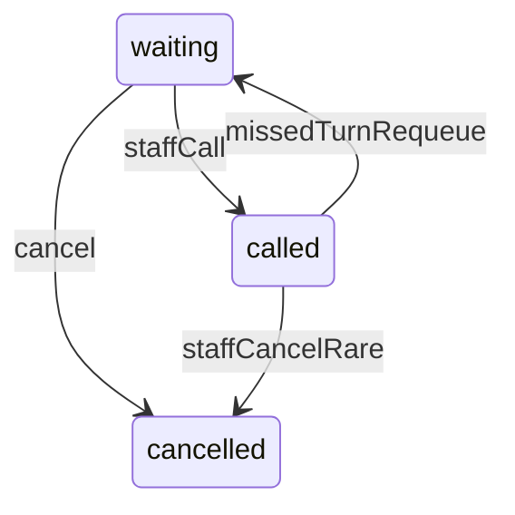

# Waitlist — 過號 (missed turn after call)

**Date:** 2026-05-21
**Status:** Active (design + initial implementation)
**Related:** [WAITLIST-SPEC.md](./WAITLIST-SPEC.md), [WAITLIST-TODO.md](./WAITLIST-TODO.md)

## Overview

**過號** means the guest did not show up within the grace period after their number was **called**. The system can then **put them back in the waiting queue** at a configurable position from the front.

This is separate from **cancelled** (guest or staff leaves the queue) and from **no_show** as a terminal state without requeue (staff may still use `no_show` manually when not requeuing).

## Definitions

### When is a party “called”?

| Condition | Field |
|-----------|--------|
| Staff pressed **Call** | `status === called` |
| Call timestamp | `notifiedAt` (epoch ms, set with call) |

### When does **過號** apply?

All of the following:

1. `WaitListSettings.missedTurnEnabled === true`
2. Entry `status === called` and `notifiedAt` is set
3. **Elapsed since call** ≥ `missedTurnMinutesAfterCall` (minutes, store-configured)

```text
elapsedMs = now - notifiedAt
過號 eligible ⇔ elapsedMs >= missedTurnMinutesAfterCall × 60 × 1000
```

Staff may also run **過號 · 重新排隊** manually once the entry is `called` (even before the timer); the same requeue rules apply.

### What happens on 過號?

1. **Requeue** the same `WaitList` row (same id, verification code, guest data).
2. Set `status` back to **`waiting`**.
3. Clear **`notifiedAt`** (no longer “currently called”).
4. Increment **`missedTurnCount`** (audit: how many times this ticket was 過號).
5. Assign a new **`queueNumber`** in the **same store + calendar day + session band** using **`missedTurnRequeuePositionFromTop`**.

Guests keep the same ticket URL/code; position polling uses the new queue number.

## Settings (`WaitListSettings`)

| Field | Type | Default | Meaning |
|-------|------|---------|---------|
| `missedTurnEnabled` | Boolean | `true` | Master switch for auto/staff 過號 requeue |
| `missedTurnMinutesAfterCall` | Int | `5` | Minutes after **call** before 過號 is allowed (auto detection / UI hint) |
| `missedTurnRequeuePositionFromTop` | Int | `3` | Reinsert at position **N** from the **front** of the **waiting** queue (1 = first in line) |

**Position semantics (`missedTurnRequeuePositionFromTop = N`):**

- Consider only entries with `status === waiting` in the **same** `storeId`, `sessionBlock`, and **calendar day** (store timezone).
- Sort by `queueNumber` ascending.
- **N = 1** → new number is the current smallest waiting `queueNumber` (everyone at or above that number shifts +1).
- **N = 2** → new number is the 2nd waiting party’s current number (or last+1 if fewer than 2 waiting).
- **N = k** → k-th waiting slot, else **after the last waiting** number.

Implementation: `web/src/lib/waitlist/missed-turn.ts` (`computeRequeueQueueNumber`).

## Queue renumbering (same band + day)

Within a transaction:

1. Load waiting rows for scope, ordered by `queueNumber`.
2. Compute `targetQueueNumber` from N.
3. `UPDATE` all waiting with `queueNumber >= target` → `queueNumber + 1` (descending order to avoid unique collisions if any).
4. `UPDATE` the 過號 entry → `waiting`, `queueNumber = target`, `notifiedAt = null`, `missedTurnCount += 1`.

**Note:** Integer `queueNumber` is not globally unique per store—only meaningful per day + session band. Gaps are allowed after cancel.

## Actors

| Actor | Behavior |
|-------|----------|
| **Staff (admin queue)** | Button **過號 · 重新排隊** on `called` rows; optional badge “過號可處理” when timer elapsed |
| **Auto (future)** | Cron or admin-page poll: eligible `called` → requeue (same action) |
| **Customer** | Sees updated position after requeue; no separate “過號” status on public UI (still `waiting`) |

## Notifications (phase 1)

- No automatic push on 過號 in phase 1.
- Optional later: “您的號碼已重新排隊為 #N”.

## API / code map

| Piece | Path |
|-------|------|
| Settings schema | `WaitListSettings` in `prisma/schema.prisma` |
| Requeue kernel | `web/src/lib/waitlist/missed-turn.ts` |
| Staff action | `web/src/actions/storeAdmin/waitlist/requeue-missed-turn.ts` |
| Settings UI | `waitlist-settings/components/client-waitlist-settings.tsx` |
| Admin queue UI | `waitlist/components/client-waitlist.tsx` |

## State diagram (requeue path)



## Edge cases

| Case | Behavior |
|------|----------|
| `missedTurnEnabled === false` | No auto hint; staff requeue action rejected |
| No waiting parties, N = 1 | `target = 1` or `max(called.queueNumber, 1)` per kernel |
| Multiple 過號 same guest same day | `missedTurnCount` increments; same id |
| Entry already `cancelled` / `no_show` | Requeue action fails |
| Wrong store / band / day | Action validates session scope from entry row |

## Verification

1. Set 過號分鐘 = 2, 重新排隊位置 = 2.
2. Call #5 → wait 2+ minutes → staff **過號 · 重新排隊** → #5 becomes `waiting` at 2nd position; others shift.
3. Customer position API shows new `ahead` count.
4. Disable 過號 → button hidden; settings save persists.

## Out of scope (later)

- Automatic background job without staff click
- SMS/LINE “you were requeued”
- Max `missedTurnCount` before force cancel
- Terminal `no_show` without requeue (keep existing enum for manual use)
