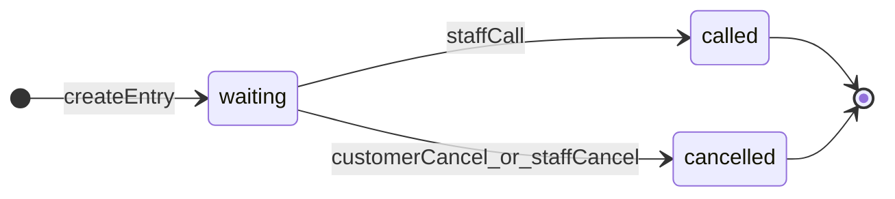

# Waitlist — implementation specification

**Date:** 2026-04-16
**Status:** Active
**Related:** Prioritized backlog: [WAITLIST-TODO.md](./WAITLIST-TODO.md). RSVP notification design [../NOTIFICATION/DESIGN-RSVP-NOTIFICATION.md](../NOTIFICATION/DESIGN-RSVP-NOTIFICATION.md); LIFF RSVP notes [../INTEGRATIONS/LINE/LIFF-RSVP.md](../INTEGRATIONS/LINE/LIFF-RSVP.md) (waitlist-specific LIFF URL is called out below).

## Functional features (implemented)

**Store configuration**

- Turn waitlist on or off; optionally require sign-in to join; optionally require first name; optionally **LINE OAuth only** (`WaitListSettings` 1:1 per store, edited under store admin waitlist settings via `updateWaitlistSettingsAction`). Systems page master toggle updates `WaitListSettings.enabled`.

**Public (`/s/[storeId]/waitlist`)**

- Join the queue with party size (adults, children) and optional contact fields (name, last name, phone) when the store allows it.
- Blocked when waitlist is disabled, when sign-in is required but the user is anonymous, when **LINE-only** is on but the user has no Better Auth **`Account` with `providerId === "line"`** (OAuth link — not the same as LINE Messaging / `User.line_userId`), when the store session is **closed** per business hours (or equivalent), or when the signed-in user is on the store **RSVP blacklist**.
- After a successful join: show **queue ticket** (entry id + **verification code**).
- **Refresh position:** parties ahead in the same session band, total waiting in session, queue number, and status (uses verification code + ids as proof).
- **Leave waitlist** (self-cancel) while status is still `waiting`.

**Store admin (`/storeAdmin/[storeId]/waitlist`)**

- Browse the waitlist in a sortable/filterable table: **status** filter (active = waiting + called, or all) and **session scope** (current session band today, whole calendar day, or capped “all” history).
- **Refresh** list from the server.
- **Call** a waiting party: moves to `called`, records wait duration and notification timestamp.
- **Cancel** a waiting party (staff-initiated); confirm dialog.
- On **call**, for signed-in customers: **in-app** message queue notification; **LINE** push when the user has a LINE id (see Notifications for URL caveat).

**Session / queue rules**

- Assign **queue numbers** per store, **calendar day** (store timezone), and **session band** (morning / afternoon / evening) derived from business hours or wall-clock fallback.

## Overview

The waitlist is a **store-scoped virtual queue** for walk-in style demand: customers receive a **queue number** and **verification code**, can **poll position** and **cancel while waiting**, and staff can **list**, **call**, or **cancel** entries from store admin.

Behavior depends on:

- **`WaitListSettings`** (`enabled`, `requireSignIn`, `requireName`, `requireLineOnly`), edited under store admin waitlist settings (`update-waitlist-settings.ts` + validation). Admin Zod **refines** that `requireLineOnly` implies `requireSignIn`.
- **Store timezone** (`store.defaultTimezone`) and **business hours** (`storeSettings.businessHours`, `store.useBusinessHours`) for **session band** resolution and “closed” gating on join.

Primary code locations:

| Area | Path |
|------|------|
| Public UI (storefront) | `web/src/app/s/[storeId]/waitlist/page.tsx` (thin); shared client `web/src/components/store/waitlist/waitlist-public-client.tsx`; loader `web/src/lib/store/waitlist/get-waitlist-public-page-data.ts` |
| Public UI (LIFF) | `web/src/app/(root)/liff/[storeId]/waitlist/page.tsx` |
| Store admin UI | `web/src/app/storeAdmin/(dashboard)/[storeId]/(routes)/waitlist/page.tsx`, `components/client-waitlist.tsx` |
| Waitlist toggles UI | `web/src/app/storeAdmin/(dashboard)/[storeId]/(routes)/waitlist-settings/` |
| Customer actions | `web/src/actions/store/waitlist/*` |
| Staff actions | `web/src/actions/storeAdmin/waitlist/*` |
| Session logic | `web/src/utils/waitlist-session.ts` |
| Schema | `web/prisma/schema.prisma` (`WaitList`, `WaitListSettings`, `WaitListStatus`, `WaitlistSessionBlock`) |

## Data model (as implemented)

### `WaitList` (Prisma)

- **Identity / queue:** `id`, `storeId`, `queueNumber` (integer, **per store + session band + calendar day** in store timezone).
- **Session:** `sessionBlock` — `morning` \| `afternoon` \| `evening` (`WaitlistSessionBlock`).
- **Guest proof / lookup:** `verificationCode` (unique string, generated server-side).
- **Party:** `numOfAdult` (default 1), `numOfChild` (default 0).
- **Contact / CRM:** optional `customerId`, `name`, `lastName`, `phone`, `message` (note: create path sets `message` to `null`).
- **Lifecycle:** `status` — `waiting` \| `called` \| `cancelled` \| `no_show` (`WaitListStatus`).
- **Metrics:** `waitTimeMs` — milliseconds from `createdAt` until status became `called` (set once when calling). `notifiedAt` set when called (same moment as notification attempt).
- **Optional link:** `orderId` (unique optional FK to `StoreOrder`) — **not written by any waitlist action** in `web/src`; reserved or future use.
- **Audit:** `createdBy`, `createdAt`, `updatedAt` (epoch ms `BigInt` per project conventions).

### `WaitListSettings` (Prisma, 1:1 `Store`)

- `enabled` — master switch; public page shows disabled message when false. Nav waitlist group gated on this flag (`getStoreWithRelations` includes `waitListSettings`).
- `requireSignIn` — forces Better Auth session; UI prompts sign-in; `create-waitlist-entry` rejects without session.
- `requireName` — requires non-empty `name` (client schema + server re-check).
- `requireLineOnly` — requires signed-in user and an **`Account`** row with **`providerId === "line"`** (Better Auth LINE OAuth). Public UI shows LINE connect (`LineLoginButton`) when signed in but not linked. Sign-in links may append `lineOnly=1` for LINE-first `/signIn` UX.

## Session resolution (core business rule)

Implemented in `web/src/utils/waitlist-session.ts`:

1. If **`useBusinessHours`** is true and **`businessHours`** JSON is valid, parse via `BusinessHours` and derive the current **waitlist session block** from the open interval, or return **`{ closed: true }`** when the store is closed.
2. Otherwise (hours off or invalid JSON), fall back to **wall-clock thirds** in the store timezone: before 08:00 → morning; 08:00–16:00 → afternoon; from 16:00 → evening.

**Join** (`create-waitlist-entry.ts`): if session resolves to closed, join fails with a translated “closed” error.

**Admin list** (`list-waitlist.ts`): `sessionScope === "current_session"` filters to today’s window and, when not closed, the **resolved `sessionBlock`**; if closed, it falls back to **all entries for the calendar day** (no session filter) so staff still see today’s data.

## Public (customer) flows

### Routes and UI

- **`/s/[storeId]/waitlist`** — Server page loads store + `WaitListSettings`, session user + LINE account check; renders `WaitlistPublicClient`.

### UX summary

1. If waitlist disabled → short message + link back to shop.
2. If sign-in (or LINE-only) is required but not signed in → sign-in CTA with `callbackUrl` to this page (adds `lineOnly=1` when the store requires LINE-only).
3. If LINE-only and signed in but no LINE OAuth account → short explanation + **LINE** connect button (`callbackUrl` back to this waitlist URL).
4. **Join form:** adults (required min 1), children, optional name/last name/phone depending on settings; phone validated with `validatePhoneNumber` when provided.
5. After join → show **entry id** and **verification code**; buttons to **refresh position** or **leave waitlist** (cancel).

### Server actions (`web/src/actions/store/waitlist/`)

| File | Role |
|------|------|
| `create-waitlist-entry.ts` | Creates row; enforces `WaitListSettings`, blacklist (`rsvpBlacklist`), LINE-only + `Account` check, session closed check, assigns `queueNumber` within day+band, generates verification code. Uses `baseClient` (no store membership on action — store existence + settings enforce access). |
| `create-waitlist-entry.validation.ts` | Zod schema; `buildCreateWaitlistEntrySchema` adds client-side name rule when required. |
| `get-waitlist-queue-position.ts` | Proves identity with `storeId` + `waitlistId` + `verificationCode`; returns `ahead`, `waitingInSession`, `status`, `queueNumber`, `joinedAt`, `waitTimeMs` (after called). |
| `get-waitlist-queue-position.validation.ts` | Input schema. |
| `cancel-my-waitlist-entry.ts` | Same proof as position; only if `status === "waiting"` → `cancelled`. |
| `cancel-my-waitlist-entry.validation.ts` | Input schema. |

### Additional join rules

- **Blacklist:** if `customerId` is set and a `rsvpBlacklist` row exists for that user and store, join throws `SafeError`.
- **Signed-in backfill:** when sign-in is required and `customerId` resolves, server may fill `name`/`phone` from `User` if missing.

## Store admin flows

### Routes and UI

- **`/storeAdmin/[storeId]/waitlist`** — Loads initial list via `listWaitlistAction` with defaults `statusFilter: "active"`, `sessionScope: "current_session"`.
- **`ClientWaitlist`** — Data table with filters, refresh, per-row **Call** and **Cancel** (confirm modal), columns for queue #, session, party, contact, status, created time, wait duration after call, notified time.

### Server actions (`web/src/actions/storeAdmin/waitlist/`)

| File | Role |
|------|------|
| `list-waitlist.ts` | `storeActionClient`; filters by `statusFilter` (`active` = waiting+called, `all` = no status filter), `sessionScope` (`current_session`, `today`, `all` with max 300 rows for `all`). |
| `list-waitlist.validation.ts` | Zod for filters. |
| `waitlist-list-entry.ts` | TypeScript type for list row after BigInt transform. |
| `call-waitlist-number.ts` | Only if `status === "waiting"` → `called`, sets `waitTimeMs`, `notifiedAt`; optional in-app + LINE notifications (see below). |
| `call-waitlist-number.validation.ts` | `waitlistId` input. |
| `cancel-waitlist-entry.ts` | Staff cancel: only `waiting` → `cancelled` (not already cancelled; not called). |

**Note:** Staff cancel and customer self-cancel both only apply while **`waiting`**. After **called**, the staff cancel path rejects; customer cancel path rejects as well.

## Notifications (on “call”)

From `call-waitlist-number.ts`:

- **In-app:** If `customerId` and store `ownerId` exist, creates a `messageQueue` row (`notificationType: "waitlist"`, `actionUrl: /s/{storeId}/waitlist`).
- **LINE:** If the customer has `line_userId`, sends via `NotificationService` with `actionUrl: /liff/{storeId}/waitlist`.

**LINE URL:** [`call-waitlist-number.ts`](../../src/actions/storeAdmin/waitlist/call-waitlist-number.ts) sets `actionUrl` to **`/liff/{storeId}/waitlist`**. LIFF bootstrap lives under [`web/src/app/(root)/liff/`](../../src/app/(root)/liff/) with [`LiffProvider`](../../src/providers/liff-provider.tsx).

There is **no SMS or email** branch in `call-waitlist-number.ts` for guests who only have `phone` without in-app/LINE identity.

## Industry / product checklist (research-backed)

Common expectations for restaurant or venue waitlist products (condensed from vendor and editorial sources such as [Yelp — waitlist management](https://restaurants.yelp.com/articles/waitlist-management/), [QueueAt — online waitlist](https://queueat.com/blog/how-to-reduce-restaurant-wait-times-with-an-online-waitlist-system/), and SMS-focused vendor guidance):

- **Multi-channel alerts:** SMS (and sometimes email) for table-ready or “you’re next”; two-way SMS to confirm, delay, or cancel.
- **ETA / place in line:** Estimated wait minutes or ranges, updated as the queue moves; conservative quoting to reduce walk-offs.
- **Self check-in:** QR codes, kiosk, or “text to join” in addition to web.
- **Host tools:** Floor plan / table assignment, merge with reservations, party merge/split.
- **Integrations:** POS or table-management sync; analytics (average wait, peak times, no-show rate).
- **Policy automation:** Auto-remove or no-show after timeout; reconfirmation pings.
- **Compliance (SMS):** For marketing texts, jurisdictions often require **documented consent** (e.g. disclosure, timestamp, channel); transactional “your table is ready” is often treated differently but products still log opt-in. See e.g. industry write-ups on [restaurant SMS consent](https://leadcompliant.com/articles/consent-management/consent-for-restaurant-marketing-texts) and [SMS best practices for restaurants](https://www.text-em-all.com/blog/sms-for-restaurants).

**Marketing (this repo):** Storefront waitlist product copy can appear in `web/src/app/(root)/unv/components/waitlist-marketing-body.tsx` (universal landing), separate from the functional `/s/[storeId]/waitlist` flow.

## State machine (implemented paths)

Prisma also defines `no_show`, but **no waitlist action** under `storeAdmin/waitlist` or `store/waitlist` transitions an entry to `no_show`.

## Gaps: implemented vs partial vs not implemented

For **prioritized backlog items** (Critical / High / …) and execution notes, see [WAITLIST-TODO.md](./WAITLIST-TODO.md).

| Topic | In codebase today | Typical industry / product expectation |
|------|-------------------|----------------------------------------|
| Queue + session band + day boundary | Yes (`queueNumber` per day + `sessionBlock` in store TZ) | Yes |
| Verification code + self-service cancel | Yes | Yes (often SMS-linked instead of manual code) |
| Position / “parties ahead” | Yes (`ahead`, `waitingInSession` from `getWaitlistQueuePositionAction`) | **UX:** lead with a prominent “how many waiting ahead” count; ETA minutes deferred |
| ETA in minutes | Not computed | Optional later if product wants time estimates |
| SMS / email notify | Not in waitlist call path | Very common for guests |
| In-app + LINE on call | Yes for signed-in + LINE-linked users | Common in LINE-heavy markets |
| `WaitListStatus.no_show` | Enum only | Staff “no show” or auto-timeout |
| `message` field | Always `null` on create | Optional guest notes |
| Staff actions after `called` | No staff transition to `no_show` yet; `called` stays in **active** filter (`waiting` + `called`) | Staff no-show / timeout, or filter tweaks |
| `statusFilter: "all"` | Includes historical statuses in UI labels | OK; `no_show` would show raw if ever set |
| Capacity / max queue | Not enforced | Optional caps when kitchen/seating saturated |

## Source file index (for maintainers)

**Customer**

- `web/src/actions/store/waitlist/create-waitlist-entry.ts`
- `web/src/actions/store/waitlist/create-waitlist-entry.validation.ts`
- `web/src/actions/store/waitlist/get-waitlist-queue-position.ts`
- `web/src/actions/store/waitlist/get-waitlist-queue-position.validation.ts`
- `web/src/actions/store/waitlist/cancel-my-waitlist-entry.ts`
- `web/src/actions/store/waitlist/cancel-my-waitlist-entry.validation.ts`

**Staff**

- `web/src/actions/storeAdmin/waitlist/list-waitlist.ts`
- `web/src/actions/storeAdmin/waitlist/list-waitlist.validation.ts`
- `web/src/actions/storeAdmin/waitlist/waitlist-list-entry.ts`
- `web/src/actions/storeAdmin/waitlist/call-waitlist-number.ts`
- `web/src/actions/storeAdmin/waitlist/call-waitlist-number.validation.ts`
- `web/src/actions/storeAdmin/waitlist/cancel-waitlist-entry.ts`
- `web/src/actions/storeAdmin/waitlist/cancel-waitlist-entry.validation.ts`

**Settings**

- `web/src/app/storeAdmin/(dashboard)/[storeId]/(routes)/waitlist-settings/components/client-waitlist-settings.tsx`
- `web/src/actions/storeAdmin/waitlist/update-waitlist-settings.ts` (+ `.validation.ts`)
- `web/src/lib/store/waitlist/ensure-waitlist-settings.ts` (idempotent row creation)
- `web/src/lib/store/waitlist/has-line-linked-account.ts`

## Summary

The current implementation is a **session-aware numbered waitlist** with **verification-code security** for public cancel/position, **staff call/cancel** for waiting parties, and **notifications only for authenticated customers** (in-app + optional LINE to **`/liff/{storeId}/waitlist`**). The largest documented gaps versus common expectations are **SMS guest alerts** for phone-only parties, **clearer customer-facing emphasis on parties ahead** (counts already returned), and **`no_show` / post-`called` lifecycle** handling.
